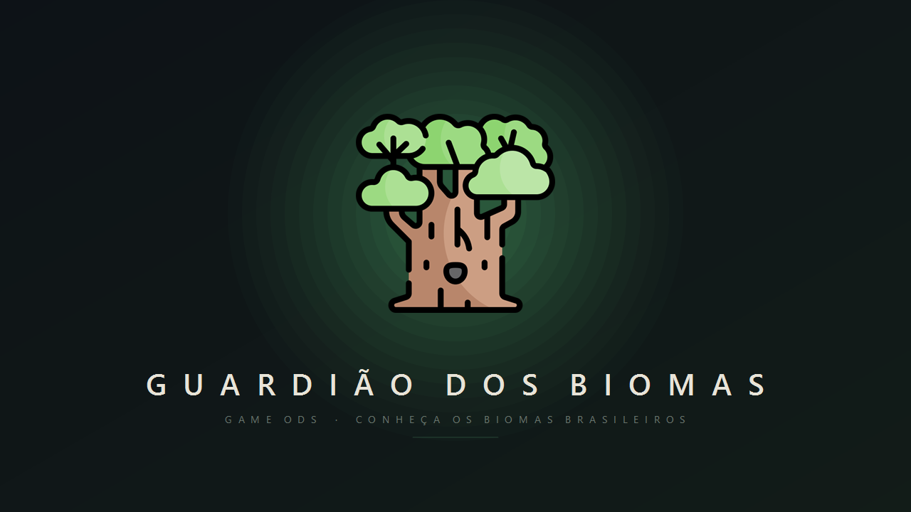
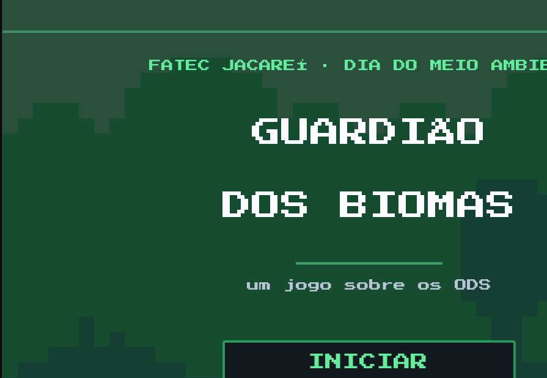
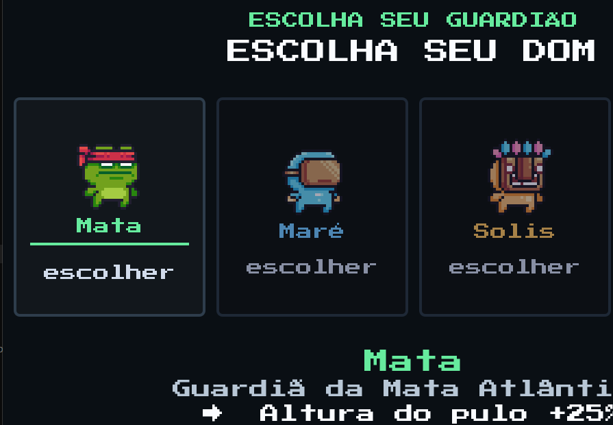
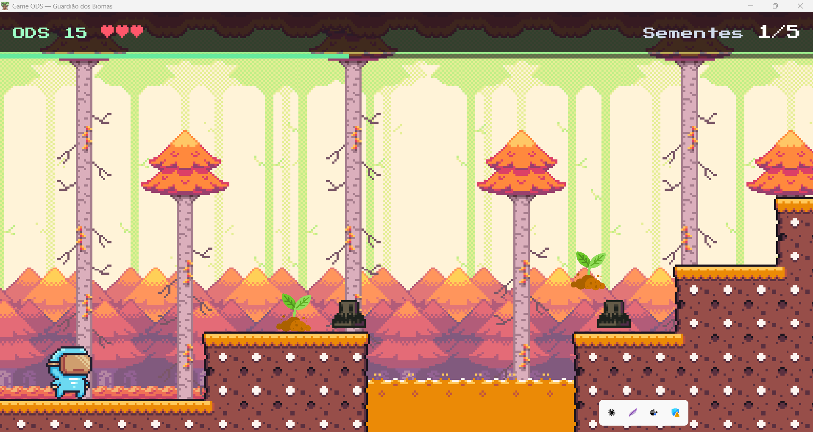
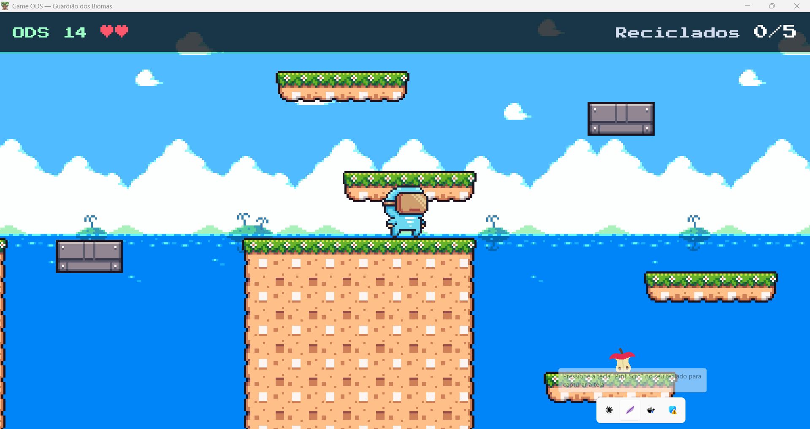
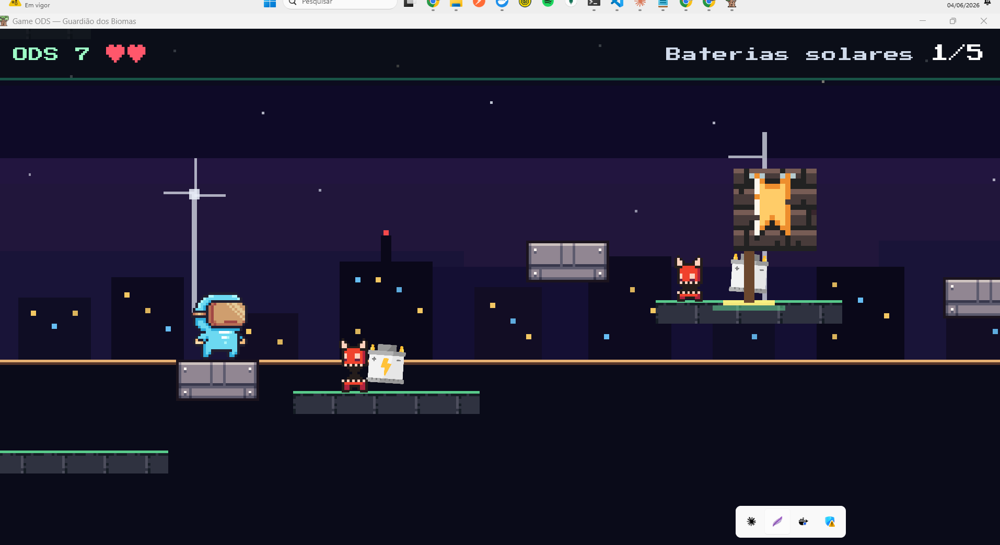
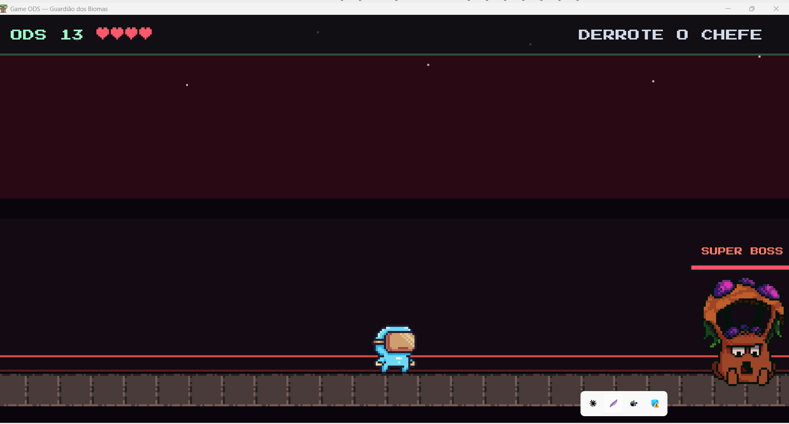

# 🌍 Guardião dos Biomas

> Um jogo de plataforma 2D sobre os Objetivos de Desenvolvimento Sustentável (ODS) da ONU.
> Desenvolvido para o Dia do Meio Ambiente — **FATEC Jacareí · DSM**.

<p align="center">
  
</p>

---

## 🎯 Sobre o projeto

**Guardião dos Biomas** é um jogo educativo onde o jogador escolhe um dos quatro Guardiões — cada um representando um bioma brasileiro — e atravessa quatro fases que ilustram os ODS **15** (Vida Terrestre), **14** (Vida na Água), **7** (Energia Limpa) e **13** (Ação Climática).

Cada fase conta uma microhistória ambiental, com inimigos que personificam ameaças (poluição, desmatamento, indústria suja) e um chefe que precisa ser derrotado pra desbloquear o portal. Após as três jornadas, o Guardião enfrenta um **super boss final** — o "vazio" — que representa a indiferença coletiva.

<p align="center">
  
  
</p>

---

## 🌱 Criatividade & Sustentabilidade — os pilares do desafio

O projeto foi construído sobre os dois pilares propostos no desafio do Dia do Meio Ambiente da FATEC Jacareí:

### Sustentabilidade
- **Cada fase é um ODS da ONU**: Floresta (ODS 15 · Vida Terrestre), Oceano (ODS 14 · Vida na Água), Cidade (ODS 7 · Energia Limpa) e Coração do Mundo (ODS 13 · Ação Climática).
- **Cada Guardião personifica um bioma brasileiro** — Mata Atlântica, Manguezal, Cerrado e Caatinga — transformando os jogadores em defensores simbólicos do que precisa ser preservado.
- **Os inimigos são metáforas das ameaças reais**: poluição, desmatamento, indústria suja. O super boss final — o "vazio" — representa a indiferença coletiva diante da crise climática.
- **O ataque é uma semente**: a única arma do jogador é plantar — o gesto mais simples e mais sustentável que existe.

### Criatividade
- **Gamificação como linguagem**: traduzir os ODS, que normalmente vivem em relatórios e cartilhas, para uma linguagem que adolescentes e crianças realmente consomem — pixel art, plataforma 2D, trilha sonora, chefes.
- **Narrativa simbólica**: o jogador não "lê" sobre meio ambiente — ele *encarna* um Guardião, atravessa quatro biomas, derrota o que ameaça cada um e enfrenta o vazio coletivo no final.
- **Mecânicas que reforçam a mensagem**: pulo duplo, wall slide, combo timer, sementes como projétil, checkpoints como bandeiras coloridas — design feito pra ser divertido e, ao mesmo tempo, fazer sentido com o tema.
- **Direção de arte coesa**: dark-first, tipografia pixel (Press Start 2P), paleta por bioma, splash editorial. O jogo se apresenta com identidade própria, não como mais um platformer genérico.

---

## 👥 Equipe

- **Alicia Silva Dias**
- **Gabrielly Neu dos Santos**
- **Manuela Lucia Lemes de Castro**
- **Pedro Claudino Nunes**
- **Gabriel Teodoro**

---

## 🎮 Como jogar

### Controles

| Ação | Tecla |
|---|---|
| Andar | `A` / `D` ou `←` / `→` |
| Pular / Pulo duplo | `W` / `↑` / `Espaço` |
| Agachar / Deslizar | `S` / `↓` |
| **Atacar (lançar semente)** | `X` ou `J` |
| Voltar pro menu | `Esc` |

### Mecânicas

- **Pulo duplo** — toque pular duas vezes no ar
- **Stomp** — pular em cima do inimigo (caindo) o derrota
- **Projétil** — lance sementes (X/J) pra atacar à distância
- **Wall slide** — desliza em paredes verticais
- **Combo timer** — pega coletáveis em sequência sem deixar o cronômetro zerar
- **Checkpoints** — bandeiras coloridas salvam seu progresso na fase

### Fluxo do jogo

```
Menu Principal
  └── Escolha seu Guardião (Mata · Maré · Solis · Raíz)
       └── Floresta (ODS 15)
            └── Oceano (ODS 14)
                 └── Cidade (ODS 7)
                      └── Coração do Mundo — Super Boss (ODS 13)
                           └── Vitória + Créditos
```

---

## 📸 As 4 fases

<table>
  <tr>
    <td align="center">
      <br/>
      <sub><b>🌳 ODS 15 · Vida Terrestre</b> — Floresta</sub>
    </td>
    <td align="center">
      <br/>
      <sub><b>🌊 ODS 14 · Vida na Água</b> — Oceano</sub>
    </td>
  </tr>
  <tr>
    <td align="center">
      <br/>
      <sub><b>⚡ ODS 7 · Energia Limpa</b> — Cidade</sub>
    </td>
    <td align="center">
      <br/>
      <sub><b>🌡️ ODS 13 · Ação Climática</b> — Coração do Mundo (Super Boss)</sub>
    </td>
  </tr>
</table>

---

## 🌱 Os 4 Guardiões

| Guardião | Bioma | Poder |
|---|---|---|
| **Mata** 🟢 | Mata Atlântica · ODS 15 | Pulo +25% |
| **Maré** 🔵 | Manguezal · ODS 14 | Velocidade +30% |
| **Solis** 🟡 | Cerrado · ODS 7 | Raio de coleta 2× |
| **Raíz** 🔴 | Caatinga · ODS 13 | Vida extra |

---

## 🛠️ Stack técnica

- **Engine:** [Godot 4.6](https://godotengine.org/)
- **Linguagem:** GDScript
- **Renderer:** Forward Mobile (Vulkan)
- **Plataforma:** Windows desktop (exportável pra Linux/Mac)

---

## 🚀 Como rodar (modo desenvolvimento)

### Pré-requisitos
- [Godot 4.6+](https://godotengine.org/download) instalado

### Passos
1. Clone o repositório:
   ```bash
   git clone https://github.com/<seu-usuario>/guardiao-dos-biomas.git
   ```
2. Abra o Godot Engine
3. Clique em **Import** → selecione `project.godot` da pasta clonada
4. Clique em **Play** (▶️) ou pressione `F5`

---

## 📦 Como gerar o `.exe` (executável Windows)

### Setup (uma vez)
1. No Godot, vá em **Editor → Manage Export Templates**
2. Clique em **Download and Install** (vai baixar ~600 MB, demora alguns minutos)

### Exportar
1. **Project → Export...**
2. **Add...** → escolha **Windows Desktop**
3. Em **Options → Binary Format**:
   - **Embed PCK** ✅ (gera um único `.exe` sem arquivos extras)
4. Em **Resources → Filters to export**, deixe vazio (exporta tudo)
5. Clique em **Export Project...**
6. Salva como `GuardiaoDosBiomas.exe` numa pasta vazia (ex: `build/`)
7. O Godot vai gerar:
   - `GuardiaoDosBiomas.exe` (executável principal — só isso precisa rodar)
   - `GuardiaoDosBiomas.console.exe` (versão com console pra debug, opcional)

### Pra rodar em outro PC
- Copie apenas o `GuardiaoDosBiomas.exe` (com Embed PCK ativo, tudo está dentro)
- Dê duplo-clique pra rodar
- **Não precisa Godot instalado no outro PC**

> ⚠️ Se na primeira execução o Windows Defender bloquear, clique em "Mais informações" → "Executar assim mesmo" (é normal pra `.exe` sem assinatura digital).

---

## 🎨 Créditos de assets

| Asset | Fonte | Licença |
|---|---|---|
| Personagens (Pixel Adventure 1) | [Pixelfrog](https://pixelfrog-assets.itch.io/pixel-adventure-1) | CC0 |
| Inimigos & bosses | [0x72 DungeonTileset II](https://0x72.itch.io/dungeontileset-ii) | Free |
| Super boss (Enemy3) | Asset pack indie | Free |
| Tilesets ambientais | [Kenney Seasonal Tilesets](https://kenney.nl/) | CC0 |
| Ícones (lixeiras, sementes, baterias) | [Flaticon](https://www.flaticon.com) | Free w/ attribution |
| Fonte (Press Start 2P) | [Google Fonts](https://fonts.google.com/specimen/Press+Start+2P) | OFL |
| Música | Pixabay + OpenGameArt (Visager, Snabisch, etc) | CC-BY / CC0 |
| SFX | [sfxr.me](https://sfxr.me) | CC0 |
| Base inicial do projeto | [Rafael Forbeck — Godot do Zero 2025](https://youtube.com/playlist?list=PLNlPErl_v81vNINVVotsh0nYBBSp4LEgY) | MIT |

---

## 📁 Estrutura do projeto

```
guardiao-dos-biomas/
├── audio/
│   ├── music/        # trilhas por fase
│   └── sfx/          # efeitos sonoros (.wav)
├── autoload/         # singletons (GameState, MusicPlayer, SfxPlayer)
├── entities/         # cenas de gameplay (player, boss, checkpoint, etc)
├── fonts/            # PressStart2P
├── kenney_*/         # asset packs Kenney
├── scene/            # fases (forest, tropic, energy, final)
├── scripts/          # lógica GDScript
├── sprites/          # arte (personagens, inimigos, items, tilesets)
├── tiles/            # TileSet resources Godot
├── ui/               # telas (menu, character_select, hud, credits, etc)
├── project.godot     # config do Godot
└── README.md
```

---

## 📜 Licença

Código sob **MIT License** (veja `LICENSE`).
Assets de terceiros seguem suas próprias licenças (veja créditos acima).
